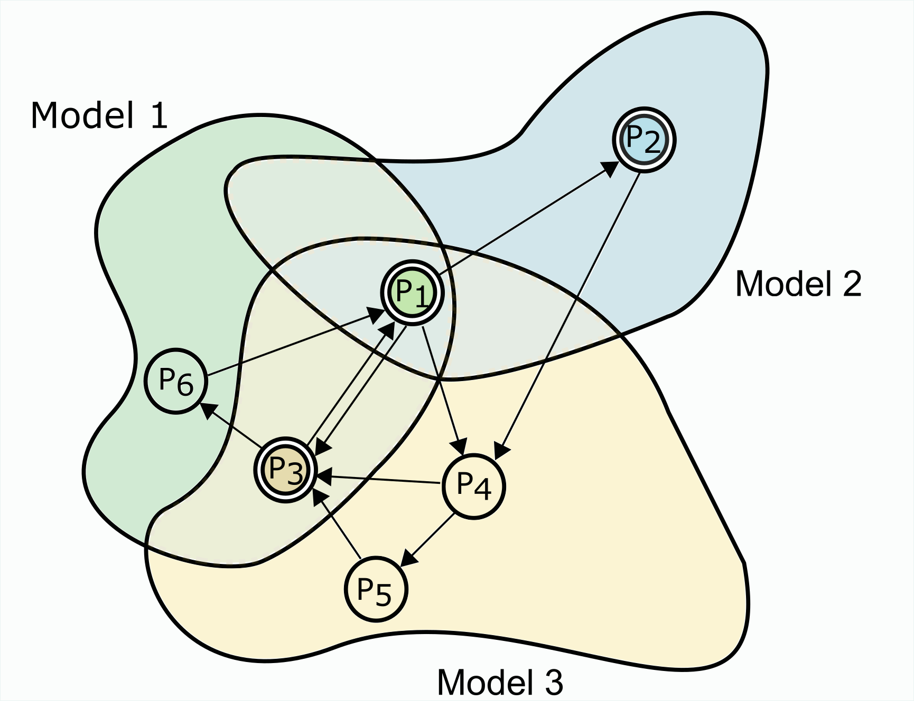
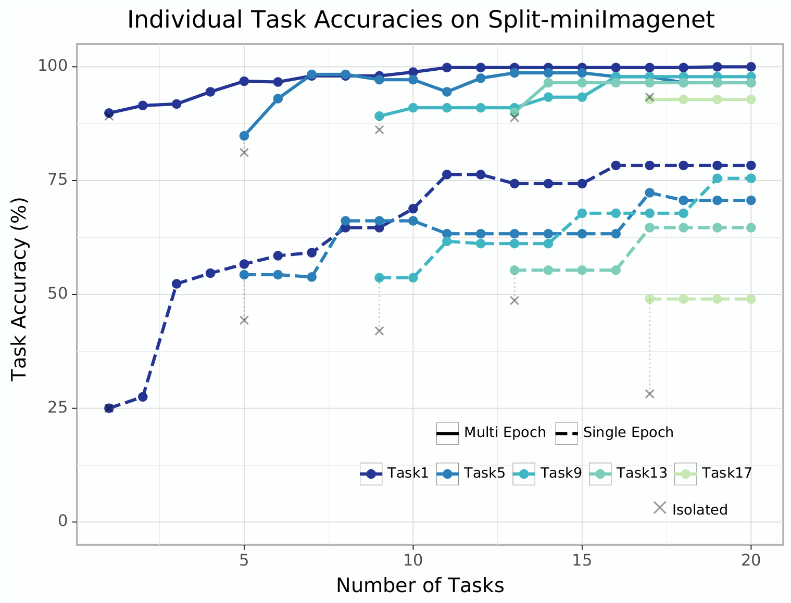

# Model Zoo

Implementation of [Model Zoo: A Growing "Brain" That Learns Continually](https://arxiv.org/abs/2106.03027) (ICLR 22). Jump into [this notebook](https://github.com/rahul13ramesh/modelzoo_continual/blob/main/modelzoo_minimal.ipynb) (which [Ashwin](https://laknath1996.github.io/) and I coded up) to get started on a simplified version of Model Zoo.


<p float="center">
  
  
</p>
Model Zoo tackles a sequence of tasks, and leverages past tasks to do well on new tasks, and new tasks to improve upon past tasks. Model Zoo explicitly splits the capacity of the model to mitigate task-competition and to exploit the relatedness of different tasks. It shows improvements as large as 10-25% when evaluated on different formulations of continual learning.  

## Setup:

To install a working environment run:
```
conda env create -f env.yaml
```

Download the `.pkl` files for Mini-imagenet 
([link](https://www.kaggle.com/whitemoon/miniimagenet)) and 
copy the files to `./data/mini_imagenet/`


## Usage

The file `modelzoo.py` is used to run the Zoo. The `-h`
flag can be used to list the argparse arguments. For example to run Model Zoo:

```bash
python modelzoo.py --data_config ./config/dataset/coarse_cifar100.yaml \
                   --hp_config ./config/hyperparam/wrn.yaml \
                   --epochs 100 --replay_frac 1.0
```


## Directory Structure

```bash
├── modelzoo.py                   # Implementation of Model Zoo
├── config:                       # Configuration files
│   ├── dataset                    
│   └── hyperparam                  
├── datasets                      # Datasets and Dataloaders
│   ├── build_dataset.py          
│   ├── cifar.py                 
│   ├── data.py                 
│   ├── mini_imagenet.py           
│   ├── mnist.py               
│   ├── modmnist.py           
├── net                           # Neural network architectures
│   ├── build_net.py
│   └── wideresnet.py
│   └── smallconv.py
└── utils                         # Utilities for logging/training
    ├── config.py
    ├── logger.py
    └── run_net.py
```

If you find this code useful, consider citing

    @inproceedings{
        ramesh2022model,
        title={Model Zoo: A Growing Brain That Learns Continually},
        author={Rahul Ramesh and Pratik Chaudhari},
        booktitle={International Conference on Learning Representations},
        year={2022},
        url={https://openreview.net/forum?id=WfvgGBcgbE7}
    }
